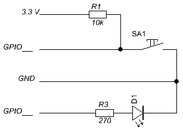

# GPIO sur Raspberry pi en C++

Mini-projet de réalisation d'une interface web de supervision distante d’un système matériel simplifié utilisant les entrées/sorties TOR disponibles sur le Raspberry PI.

L’application doit permettre de :
- Contrôler la led D1
- Visualiser l’état du switch SA1
- Tracer les activités

# Câblage

# Serveur websocket

https://github.com/joewalnes/websocketd/releases/download/v0.2.11/websocketd-0.2.11-linux_arm.zip